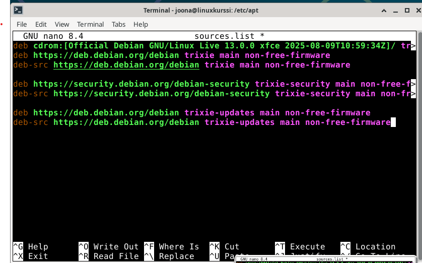
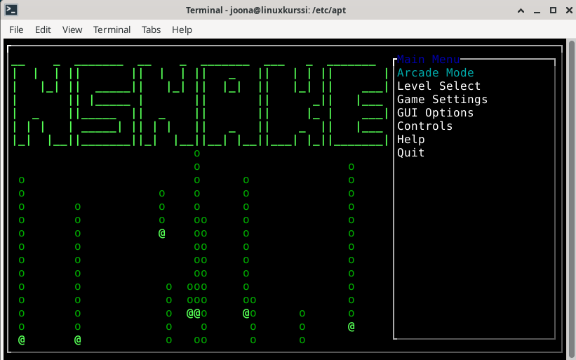
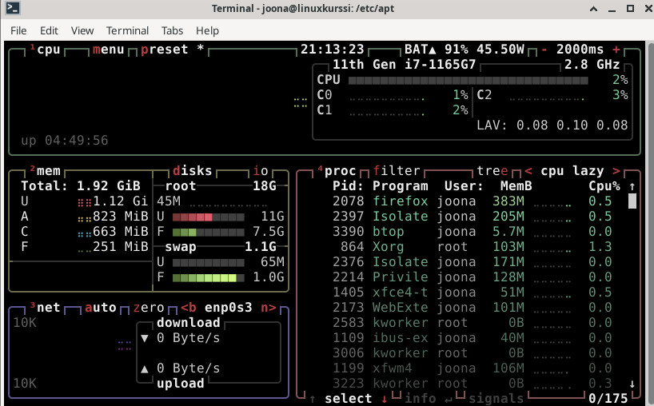
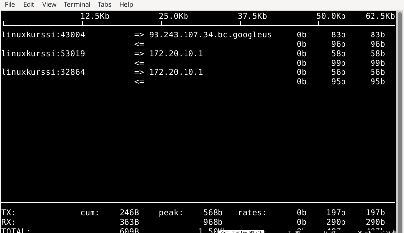
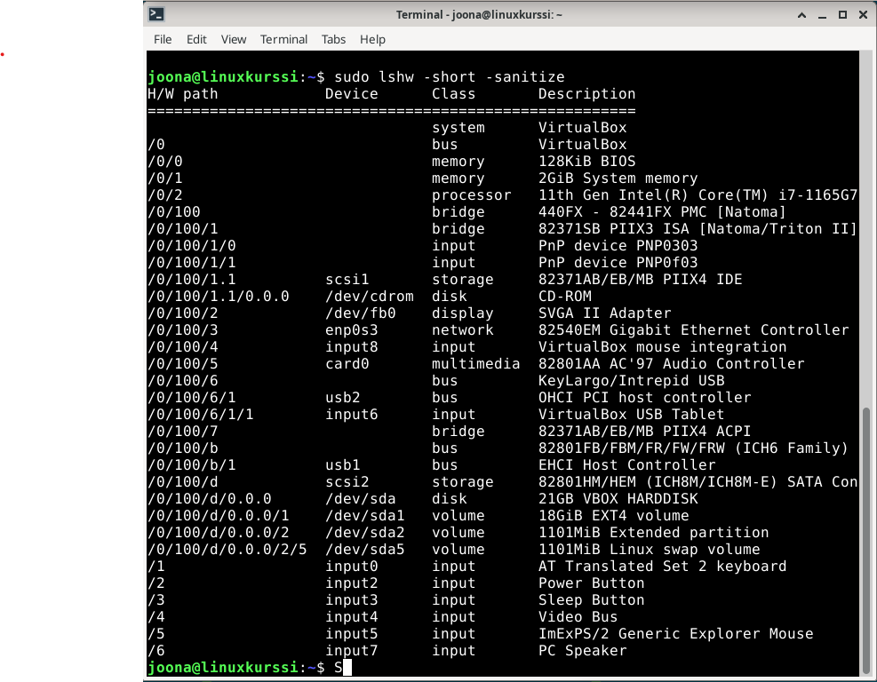

# h2 Komentaja Pingviini
## x) CLI Tärkeitä asioita
Minulle uusia komentoja oli vain tämä
- rmdir EMPTYDIR

Tab autocompletion (paina kahdesti)
- Käytä aina kun kirjoitat tiedoston nimiä

Tärkeitä hakemistoja
/home/
/etc/       System asetukset (plain txt)
/media/usb  Kaikki ulkoiset levyt
/var/log    Lokit
- /var/log/syslog
- /var/log/auth.log
- /var/log/apache2/error.log

# a.) Micro-editori
Asennetaan editori
Kokeillaan ensin:
- apt-get install micro
- sudo apt-get install micro

Kumpikaan ei toiminut, joten laitoin googlen tulille ja etsin: micro for linux
Löysin seuraavan sivun: https://github.com/zyedidia/micro
Täältä ohjeistettiin lataamalla se curlin avulla
- curl https://getmic.ro | bash

Kävin sivulla ensin katsomassa millaisen koodin se pyöräyttää, ei ainao ole fiksua installoida mitä vain netistä.
Pyöräytin komennnon ja micro saatin ladattua.

# b.) Kolme uutta komentorivi ohjelmaa
## Ensimmäinen ongelma
Yritin ladata muutamia ohjelmia paketin hallinta ohjelmistolla, mutta kävi ilmi, että se ei löytänyt niistä mitään.

Lähdin selvittämään ongelmaa.
- Muistelin, että tunnilla Johanna näytti kyseiselle ongelmalle ratkaisun

Kävin tero karvisen linux kurssin etusivulla ja löysin sieltä linkin johannan github sivulle, josta ratkaisu löytyi.

## Ongelman ratkaisu
Ratkaisu löytyi Johannan github sivulta kohdatasta "5. Populating sources.list". Linkki löytyy lähteistä. Sources.list tiedosto löytyy seuraavasta sijainnista:
$ ~ cd /etc/apt/

Hyvä tietää: Symboli "~" on lyhennys omasta kotihakemistosta
$ cd ~
- Komento siirtää sinut omaan 
kotihakemistoosi. Kannattaa kokeilla.

$ sudo nano sources.list
- sudo, koska tiedosto on kotihakemiston ulkopuolella
- Huomataan, että tiedosto on tyhjä.
- Lisätään tiedoston loppuun seuraavat rivit:

Ctr-x, y, enter
- Tallennetaan tiedosto

## Apt paketti hallinnalla ohjelmien asentaminen
## 1. Nsnake
Snake peli linuxille, kuva selventää

Asennus
$ sudo apt-get install nsnake

$nsnake

## 2. Btop
Hyödyllinen sysadmin työkalu joka näyttää visuaalisesti tietoja tietokoneesta

Asennus
$ sudo apt-get install btop

$ btop

## 3. Iftop
Taas sysadmin työkalu joka näyttää reaaliaikaista verkkoliikennettä mistä ja mihin sekä liittyvää dataa. Cli ohjelmisto myös kuten btop.

$ sudo iftop

# c.) FHS CLI revised tärkeät kansiot
Tärkeitä hakemistoja
/home/          Täältä löytyy jokaisen käyttäjän koti hakemistot
- /home/joona
/etc/           System asetukset (selko tekstissä olevat)
- /etc/apt/sources.list     Täältä löytyy apt managerin lähteet
/media/usb      Kaikki ulkoiset muistit ovat täällä
/var/log        Lokit
- /var/log/syslog
- /var/log/auth.log
- /var/log/apache2/error.log

# d.) Grep-komento
Noniin tästähän teinkin jo h1 tehtävässä "lempiohjelmani grep", joten jatketaan tämänä käyttöä taas lipunryöstössä. Hyvä tekosyy tehdä lisää lipunryöstöjä...

## 1. Lämmittely
Haluutan löytää vain tiedostot kyseisestä hakemistosta joiden pääte on .txt. Tämä on hyvä aloitus jos haluaa vaikkapaa poistaa tai siirtää ne jonnekin muualle.

$ ls . | grep ".txt$"
hash2.txt
hash.txt
- Dollari "$" tarkoittaa teksti joka loppuu tähän.

## 2. Grep -v argumentti
Halutaan löytää kaikki muut kuin "x" silloin käytetään argumenttia "v"

 $ ls -l | grep -v " root root "
total 52
drwxr-xr-x 3 kali    kali     4096 Mar 20 13:49 coding
drwxr-xr-x 2 kali    kali     4096 Apr 11 09:57 Downloads
-rw-r--r-- 1 kali    kali      225 Aug 22 15:07 flag
-rw-r--r-- 1 kali    kali       65 Apr  8 17:40 hash2.txt
-rw-r--r-- 1 kali    kali       41 Apr  8 17:29 hash.txt
...
- Etsittiin siis kaikki tiedostot joiden omista ja ryhmä ei ole root.

## 3. Xargs ja -l argumentit
Jokaisessa tiedostossa on "raaka" http vastaus palvelimelta ja haluamme löytää vain sen vastauksen joka täyttää seuraavat parametrit:
- HTTP/1.1 200 OK
- Host: Target
- Content-Length > 0

Hakemisto on seuraavan lainen:
└─$ ls
http1  http2  http3  http4  ....
- Vastauksia on satoja ja ovat muotoa httpN

Sen voi tehdä seuraavalla tavalla
└─$ cat $(grep -l "HTTP/1.1 200 OK" http* | xargs grep -l "Host: Target" | xargs grep -l -v "Content-Length: 0")
HTTP/1.1 200 OK
Date: Sat, 30 Aug 2025 12:00:00 GMT
Server: ExampleServer
Host: Target
Content-Type: text/plain
Content-Length: 13
- Löydettiin alle sekunnissa haluamamme teidosto.

## Aletaan purkamaan komentoa
$ cat $( ...komentoja )
- cat lukee tiedoston
- On tapa kertoa linuxille, että otetaan komennoista suorituva "output" ja annetaan se parametrina "cat" komennolla tai mille vain.
- Todella hyödyllinen jos haluaa tehdä pitkiä "one linereita"

Parametrit grep komennossa
$ grep -l "abcd.."
- Palauttaa tiedoston (nimen) joka sisältää "abcd.."

Putki |
- Tekee mitä selittää, eli "putkittaa komentoja" peräkkäin

xargs
- Extra arguments, eli voidaan putkittaa greppiin lisää grep komentoja. Tässä tilanteessa lisää rivejä joiden pitää pitää paikkansa.

$ grep -l -v "Content-Length: 0")
- v argumentti on "inversio" eli halutaan löytää se jossa ei ole tätä riviä.

# e.) Pipe
Aiemmassa viimeisessä tehtävässä käytettiinkin jo aika pitkää putkitusta, mutta sitä voi käyttää paljon muuallakin kuin grep työkalussa.

## 1. Listaa prosessien määrä
$ ps aux | wc -l
8
- ps aux komenot listaa prosessit
- wc -l laskee ne yhteen

## 2. Tee X määrä tiedostoja
$ seq 1 20 | xargs -I{} touch file{}
$ ls
file1   file11  file13  file15  file17  file19  file20  file4  file6  file8
file10  file12  file14  file16  file18  file2   file3   file5  file7  file9

Mitenkäs tämä nyt toimikaan?
- seq 1 20 laskee numerot 1 -> 20
- xargs tekee jokaisesta "inputista" komennon eli tällä tehdään X määrä touch komentoja
- -I{} toimii "placeholderina". Eli nyt jokaisen {} tilalle tulee edellisestä komennosta putkitettu numero.
- touch luo tiedoston
- file{} tekee tai mikä nimi halutaankaan tekee uuden tiedoston ja ottaa edelleen numeron. (Tämä {} määriteltiin aiemmassa xargs -I{} komennossa)

# f.) Rauta tehtävä
$ lshw
???
Huomasin, että en ollut ladannut lshw komentoa
Asensin sen seuraavalla komennolla:
$ sudo apt-get install lshw

Näytetään rauta
$ sudo lshw -short -sanitize

## Analysointi
Täältä näkyy heti, että kysessää on VirtualBox virtuaalikone
- system VirtualBox
- bus VirtualBox

Memory kohdasta näkyy RAM määrä 2GiB
Processori ns muu rauta myös

Inputit kertoo mitä on yhdistettynä koneeseen
- PC Speaker
- Video bus

# Reflektio
No huhhuh siinähän tuli ja meni tehtyä vaikka ja mitä. Grepillähän pystyy tehdä vaikka ja mitä. Minulle oli etenkin uutta tuo xargs työkalu ja miten -I{} pystyy tekemään patterneja joita putkittaa uusiin komentoihin. Aika kätevää.
Logi tiedostot nyt jäi hieman epäselväkis, pitänee niitä vielä selvitellä, mutta muuten linuxi alkaa olla jo aika tuttu ympäristö.
Toivottavasti sinulle, joka luet tätä jäi jotain uutta mieleen.

# Lähteet

https://terokarvinen.com/linux-palvelimet/#h2-komentaja-pingviini

apt-get ongelman ratkaisu:
https://github.com/johannaheinonen/johanna-test-repo/blob/main/linux-20082025.md

sysadmin työkalut
https://linuxblog.io/linux-sysadmin-tools/
overthewire.org

grep juttuja
https://www.golinuxcloud.com/grep-command-in-linux/

regex syntaxi
https://www.oreilly.com/library/view/introducing-regular-expressions/9781449338879/
Introducting Regular Expressions
Kirjoittaja: Michael Fitzgerald
Julkaisija: O'Reilly