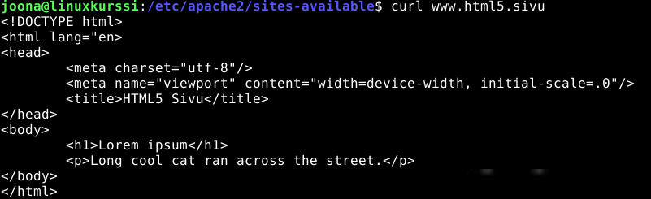

# h3 Hello web Server tehtävä
On tarkoitus tehdä HTML palvelin daemoni ja pyörittämään se virtuaalikoneelle. Tässä tehtävässä ei portforwardata, joten tämä sivu näkyy vain paikallisesti.
Sivu pitäisi hostata pilvipalveluun ja jos haluaa, ostaa domain nimi, jos haluasi sen julkiseksi, tai ainakin jos ei halua käyttää tor verkkoa (siellä sen saa helpommin ja ilmaiseksi pyörimään omalla virtuaalikoneella).

# x.) Apache muistiinpanot
## Käteviä komentoja apachelle
Apache mahdollistaa monenien webbi sivujen hostaamisen yhdellä IP osoitteella.

Kun lisää uuden sivun muista tehdä näin!
$ sudo systemctl reload apache2
- Reloadaa apache2 confit

Apachen asennus
$ sudo apt-get -y install apache2
$ echo "Default"|sudo tee /var/www/html/index.html

Uusi nimi virtuaali host nimi
$ sudoedit /etc/apache2/sites-available/pyora.example.com.conf
$ cat /etc/apache2/sites-available/pyora.example.com.conf
<VirtualHost *:80>
 ServerName pyora.example.com
 ServerAlias www.pyora.example.com
 DocumentRoot /home/xubuntu/publicsites/pyora.example.com
 <Directory /home/xubuntu/publicsites/pyora.example.com>
   Require all granted
 </Directory>
</VirtualHost>
$ sudo a2ensite pyora.example.com<nr>
$ sudo systemctl restart apache2

Oman domain nimen simulointi
- Toimii vain lokaalisti...
$ sudoedit /etc/hosts
$ cat /etc/hosts
127.0.0.1 localhost
127.0.1.1 xubuntu
127.0.0.1 pyora.example.com

## Nippeli tietoa apachesta
- Requesti -> Apache etsii VirtualHost argumentin + IP/Portti ja se vertaa ServerName ja ServerAlias hakemistoja ja täten palvelimen
- Jos ServerName on tyhjä -> FQDN default system hostname
- Tukee useita domaineja kuten, www.sivu.com tai other.sivu.com, Nämä eriteltynä omiin VirtualHost configuraatiohin
- ServerAlias mahdollistaa monia nimiä palvelimelle

# a.) Apache-webbipalvelun asennus
Suoritin komento riviltä seuraava komennot apachen asentamiseksi
$ sudo apt-get -y install apache2
$ echo "Default"|sudo tee /var/www/html/index.html

Seuraavaksi tarkistetaan, että näkyykö meidän sivu ja toimiiko se.

Hyvin näytti toimivan!

# b.) Apachen logit
Googlauksen avulla löysin, että apachen logit löytyvät seuraavasta osoitteesta
$ sudo cat /var/log/apache2/access.log

Logista näkyy pyynnön headerit:
GET / HTTP/1.1      Metodi ja protokolla sekä versio
200             HTTP vastaus koodi (200=OK)
Mozilla/5.0, Linux, ...     Pyytäjän selain, arkkitehtuuri jne

Toinen rivi on kun selain yrittää ladata sivun "logoa" ja epäonnistuu
Koodi 404 - Ei löytynyt, koska me ei olla sitä määritelty

# c.) Etusivu uusiksi
Huomaathan, että tämä on kirjattuna step by step tyylisesti mitä ongelmia kohtasin ja miten minä korjasin ne.

Luodaan seuraavalla komennolla uusi domain sivu hattu.example.com

Luotiin sille kotihakemisto samaan paikkaan
$ mkdir -p /home/joona/www/public/hattu.example.com
echo "Tervetuloa hattu.example.com" > /home/joona/www/public/hattu.example.com/index.html

## Ongelma ja ratkaisu
curl hattu.example.com
- Ei palauttanut mitään?
- Eikä myöskään firefoxista.

Luin Johanna Heinosen githubia ja löytyi ratkaisu:

Sivu pitää enabloida eli se tapahtuu seuraavasti
$ sudo a2ensite hattu.example.com.conf
- .conf loppui muös configuraatio tiedostosta... (se löytyi siis sites-available hakemistosta)

## Toinen ongelma ja ratkaisu
Ilmeisesti hakemistoissa pitää olla +x (execute) permissio, että niitä pitkin apache2 voi kävellä
- Joten pitää pitää huoli, että koko path reitin läpi on nämä tehtynä, sitten kaikki toimii

## Kaikki toimii nyt
Disabloidaan "default" sivu
$ sudo a2dissite 000-default.conf

Sitten käynnistetään apache2 uudestaan
$ systemctl reload apache2

Muutos /etc/hosts
127.0.0.1   hattu.example.com
- Nyt voidaan käyttäen nimi domainia myös accessoida meidän palvelin!

Kokeillaan vielä
$ curl localhost 
Tervetuloa hattu.example.com
- Kaikki näyttää toimiman

# e.) HTML5 sivu
Luodaan uusi sivu

1. Kotihakemisto
$ sudo mkdir -p /home/joona/www/public/www.html5.sivu 
$ sudo chown $USER:$USER /home/joona/www/public/www.html5.sivu 
- Vaihdetaan oikeudet

2. Luodaan kotisivu
$ nano /home/joona/www/public/www.html5.sivu/index.html 
- Näkyy lopuksi curlista millaisen tein...

3. Luodaan conf tiedosto
$ sudoedit /etc/apache2/sites-available/www.html5.sivu.conf

4. Enabloidaan sivu
$ sudo a2ensite www.html5.sivu.conf 
$ systemctl reload apache2 

5. Muokataan /etc/hosts 
$ sudoedit /etc/hosts 
Lisätään sinne: 
127.0.0.1   www.html5.sivu 

6. Kokeillaan sivua!
$ curl www.html5.sivu

# f.) Curl komento
Pyydetään oma
$ curl localhost 
Tervetuloa hattu.example.come
- Lähettää GET pyynnön annettuun urliin tai IP osoitteeseen
- Generoi itse tarvittavat headerit
- Palauttaa vain "body" takaisin

Curl -i localhost 
HTTP/1.1 200 OK 
Server: Apache/2.4.65 (Debian) 
Content-Type: text/html 
... jne

- Palauttaa vastaus headerit
- Näkyy mm. vastaus koodi 200 = OK
- Nämä ovat informaation mitä palvelin haluaa, jotta voidaan määritellä protokolla, versio, kontentit tyyppi ja sekä muu informaatio

# o.) Kaksi sivua samalla koneella
Muokattiin /etc/hosts teidosto
127.0.0.1       hattu.example.com
127.0.0.1       www.html5.sivu

Kokeillaan toimiiko

No toimiihan se!

Miksi tämä toimii?
- Ensimmäisessä tehtävässä käytiin läpi, että apache2 tukee useita name-based virtual hosteja
- Kun pyyntö tulee: apache2 lukee conf tiedostot läpi, ja etsii pyynnössä olevasta urlista ServerAlias ja ServerName listasta oikean sivun ja palauttaa sen

# Reflektointia
Okei olipa tehtävää. Tuli paljon ongelmia linuksin tiedosto oikeuksien kanssa, eli pitää jatkossa muistaa tarkastaa ne aluksi ja jokaiselle tiedostolle erikseen. Myös pitää pitää mielessä, että jos haluaa apachen onnistuvan liikkumaan kansioissa, ne kansiot tarvitsevat +x (execute) oikeudet jotka käyttäjällä joka pyörittää apachea on.
Opin myös, että on hyvä luoda sivut /home/ kansioon käyttäjälle joka pyörittää apachea ja pitää huoli "least permission possible" policystä tietoturvan vuoksi. Tämä sen takia, että jos joku pääsee käsiksi etäyhteydellä apache käyttäjään, niin se ei voi muokata mitään muuta tärkeätä koneelta tai onnistu vaikkapa matoamaan verkossa eteenpäin.

# Lähteet
https://terokarvinen.com/2018/04/10/name-based-virtual-hosts-on-apache-multiple-websites-to-single-ip-address/
https://terokarvinen.com/linux-palvelimet/
https://github.com/johannaheinonen/johanna-test-repo/blob/main/linux-03092025.md
https://httpd.apache.org/docs/2.4/vhosts/name-based.html