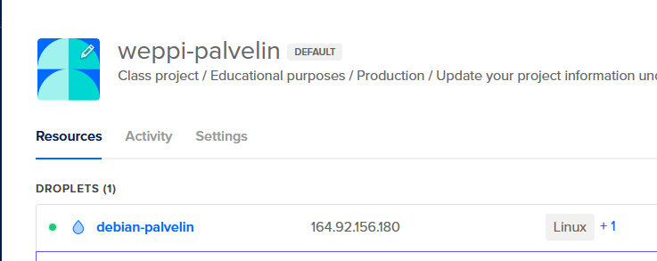
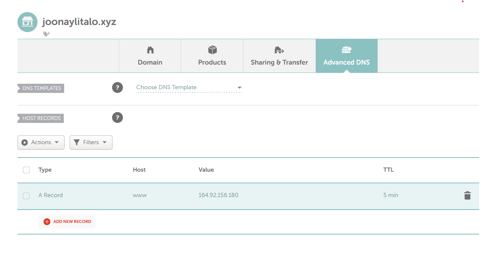
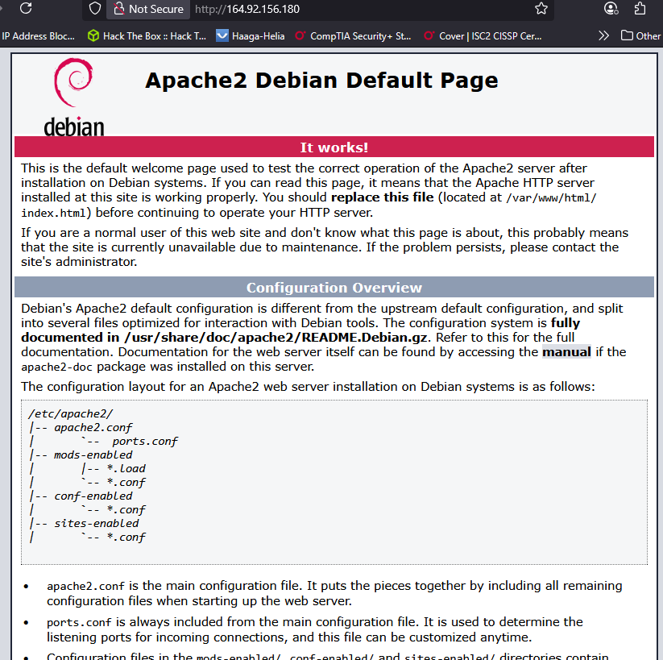
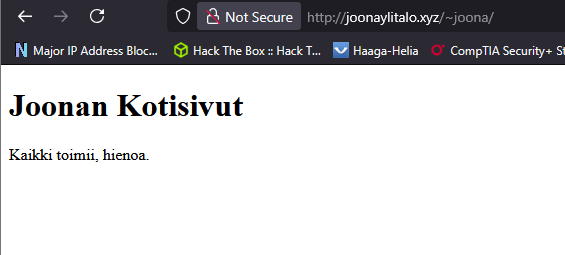

# x. Tiivistelmä

## a. Pilvipalvelimen vuokraus ja asennus

Domainnimi.

- Domainnimi osoittaa palvelimeemme
- Tarjoajia: DigitalOcean, namecheap jne
- Maksaa noin 4-5$ / kk

Virtuaalikoneen vuokraus DigitalOceanilta.

1. Hoida maksu / Billing
2. Droplets -> virtuaalipalvelin
3. Hardwaren määritys
4. Valitaan region mihin palvelin tiputetaan
5. SSH jne managointi
6. Projektin määritys

Domainnimen vuokraus.

1. Etsitään verkonnimi
2. Vuokrataan verkkonimi
3. Osoitetaan se meidän palvelimelle
4. Asetetaan virtuaalipalvelimen IP
5. Kaikki valmista

## b. Palvelin suojaan palomuurilla
Yhdistys ja päivitykset.

- Yhdistä koneelle SSH:lla
- Päivitä paketit: $sudo apt-get update

UFW määritys: ssh läpi

- $ sudo apt-get install ufw
- $ sudo ufw allow 22/tcp
- $ sudo ufw enable

## e. Kotisivut palvelimelle
Palvelimelle uusi käyttäjä.

- $ sudo adduser <nimi>
- $ sudo adduser <nimi> sudo

Lukitaan juuri.

- $ sudo usermod -lock root

Päivitykset kasaan.

- $ sudo apt-get update
- $ sudo apt-get upgrade
- $ sudo apt-get dist-upgrade

Installoidaan webbi palvelin apache2.

- $ sudo apt-get install apache2

Palomuuri ja http läpi.

- $ sudo ufw allow 80/tcp

## f. Palvelimen ohjelmien päivitys
Tapahtuu seuraavilla komennoilla (nämä kannatta ajoittaa).

- $ sudo apt-get update
- $ sudo apt-get upgrade
- $ sudo apt-get dist-upgrade

## Karvinen 2012
Näytti aika samalta kun Susannan tiivistelmä, mutta vain englanniksi.

# a.) Vuokraa oma virtuaalipalvelin
DigitalOceanista palvelimen vuokraus.

Create Droplet seuraavilla asetuksilla.

- debina x64
- Shared CPU
- Regular SSD
- 512 mb/ 1 CPU
- 10 GB ssd
- 500 GB transfer
$4 / kk

Namecheap domain vuokraus.

- joonaylitalo.xyz
- Maksoi 2.2$/vuosi
- 

# b.) Alkutoimet omalle palvelimelle

Yhdistin SSH:lla omalle palvelimelle.

ssh root@joonaylitalo.xyz

Palomuurin asennus.

$ sudo apt-get install ufw

/root

root@debian-palvelin:~#

- Toimi

Palomuuri päälle.

$ sudo ufw allow 22/tcp
$ sudo ufw enable

Kotisivut palvelimelle.

Ensin uusi palvelin käyttäjä
$ sudo adduser joona
$ sudo adduser joona sudo
...

Kokeillaan SSH uudelle käyttäjälle.

$ ssh joona@joonaylitalo.xyz

joona@debian-palvelin:~$

- Toimi

# c.) Asennetaan apache2 weppipavelu.

$ sudo apt-get install apache2

$ sudo systemctl enable apache2

$ wget localhost

~index.html

Palomuurista vielä HTTP palvelu auki.

$ sudo ufw allow 80/tcp

Ei ole vielä tullut confirmaatiota meidän domainimi palvelusta, että se olisi aktivoitu, joten kokeillaan toistaiseksi meidän IP:llä toimiiko palvelu.

Hyvin toimii!

Muokataan vielä index tiedostoa:

joona@debian-palvelin:~$ echo Testi | sudo tee /var/www/html/index.html

Testi

joona@debian-palvelin:~$ curl localhost

Testi

joona@debian-palvelin:~$

Userdir päälle.

joona@debian-palvelin:~$ sudo a2enmod userdir

Enabling module userdir...

joona@debian-palvelin:~$ sudo service apache2 restart

...

Kotihakemisto vielä.

$ mkdir html_public

Micro editorilla HTML sivu.

$ sudo apt-get install micro
...

Oikeudet kuntoon.

joona@debian-palvelin:~$ chmod 711 /home/joona

joona@debian-palvelin:~$ chmod 755 /home/joona/public_html

joona@debian-palvelin:~$ chmod -R 644 /home/joona/public_html

Nyt toimii!

<<<<<<< HEAD
Sivun linkit
https:/joonaylitalo.xyz
https:/joonaylitalo.xyz/~joona/
=======
Sivun linkit.

http://joonaylitalo.xyz

http://joonaylitalo.xyz/~joona/
>>>>>>> 7caefa8aebcf9da17fdbf5f3bcf68c12f885ee46

# Reflektiot
Oli todella helppoa koko prosessi, harmi vain, että github education paketti ei halunnut totella joten jouduin maksamaan tästä (7e yht). Onneksi ei paljoa maksa.

Opin nyt miten käytännössä virtuaalikoneen ostaminen ja domainin ostaminen tapahtuu ja ihan siistiä, että nyt on oma domainnimi.

Voisi vielä lisätä SSL sertificaatin lest-encryptista, teenkin sen varmaan myöhemmin.

# Lähteet
x. Tiviistelmä:
https://susannalehto.fi/2022/teoriasta-kaytantoon-pilvipalvelimen-avulla-h4/
https://terokarvinen.com/2017/first-steps-on-a-new-virtual-private-server-an-example-on-digitalocean/
https://www.namecheap.com/
https://www.digitalocean.com/
https://terokarvinen.com/linux-palvelimet/
