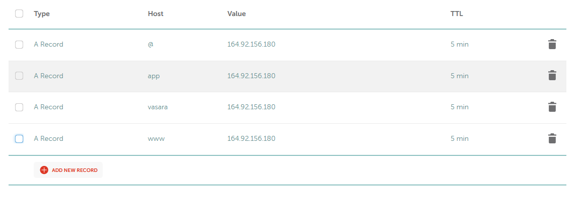
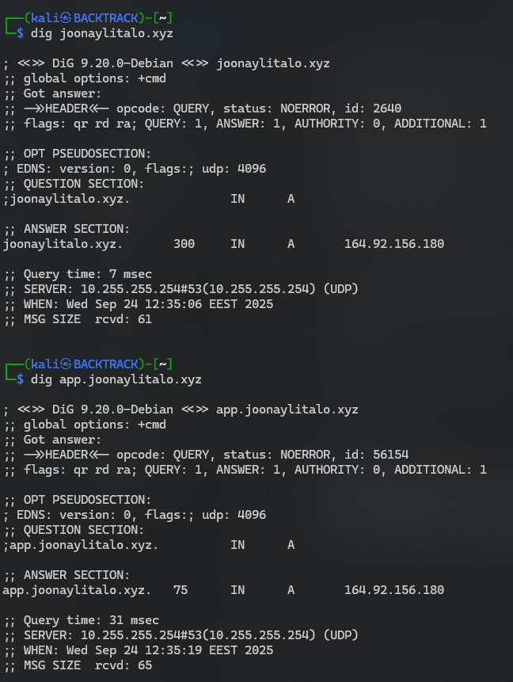

# h5 Nimekäs

# a.) Nimi
- Vuokrasin namecheapista joonaylitalo.xyz.
- Oli todella helppoa.
- maksoi 1.87$/vuosi.
- Linkki sivulle: https://joonaylitalo.xyz

# b.) Alidomain
- Tein namecheapin ohjeiden mukaan alidomainit
- Lisäsin seuraavat host recordsiin

https://vasara.joonaylitalo.xyz/ 
https://app.joonaylitalo.xyz/ 

# c.) Nimen dns tiedot
- Host komennon antamat tiedot
- ┌──(kali㉿BACKTRACK)-[~]
- └─$ host app.joonaylitalo.xyz
- app.joonaylitalo.xyz has address 164.92.156.180

- ┌──(kali㉿BACKTRACK)-[~]
- └─$ host joonaylitalo.xyz
- joonaylitalo.xyz has address 164.92.156.180
- joonaylitalo.xyz mail is handled by 20 eforward5.registrar-servers.com.
- joonaylitalo.xyz mail is handled by 15 eforward4.registrar-servers.com.
- joonaylitalo.xyz mail is handled by 10 eforward3.registrar-servers.com.
- joonaylitalo.xyz mail is handled by 10 eforward2.registrar-servers.com.
- joonaylitalo.xyz mail is handled by 10 eforward1.registrar-servers.com.

- ┌──(kali㉿BACKTRACK)-[~]
- └─$ host app.joonaylitalo.xyz
- app.joonaylitalo.xyz has address 164.92.156.180

- Dig komennon tiedot

## Analysointi
Oma palvelin (joonaylitalo.xyz)
- Hoitaja: eforward3.registrar-servers.com

Name.com
- Hoitaja: alt1.aspmx.l.google.com

Tesla.com
- Hoitaja näyttäisi olevan tesla itse tai outlook
- tesla-com.mail.protection.outlook

# Lähteet
Alidomain lähde:
https://www.namecheap.com/support/knowledgebase/article.aspx/9776/2237/how-to-create-a-subdomain-for-my-domain/
https://terokarvinen.com/linux-palvelimet/