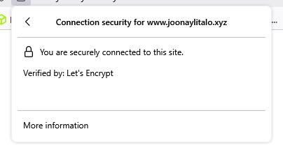
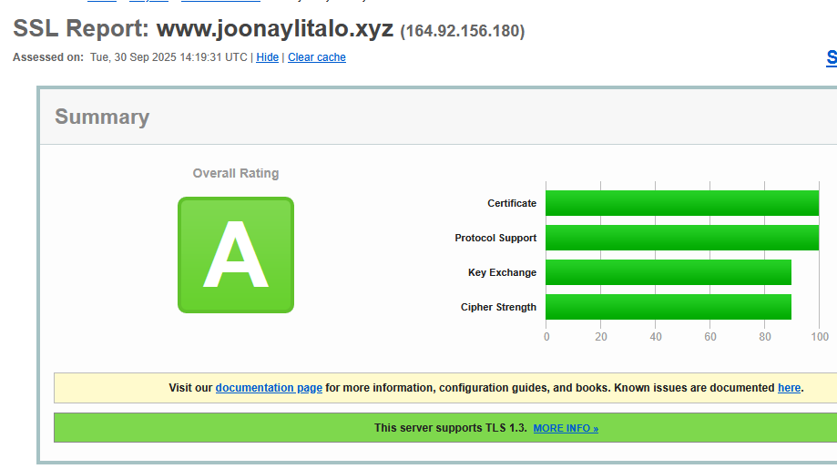

# Salataampa
## x.) Lets encrypt
- Idea on saada domain validaatio HTTPs käyttöön
- Ilmainen palvelu

1. ACME client
- Esim Certbot
2. Generoi avain pari
- private ja public keyt
3. Pyydä certfikaattia
- Lähetä CSR Lets encryptille
4. Domain validaatio
- Testaa vain että omistatko domainin
5. Vastaus
6. Certifkaatti
- Saat SSL/TLS certifikaatin signattuna lets encryptiltä
7. Asenna certti
8. Automaattinen uudistus
- Yleensä 60pv välein on hyvä

## a.) Hankitaanpa certti meille
- Seurasin certbotin ohjeita
- Koko prosessi meni reilu 5 min
- Valitsin ensin: apache ja linux (pip)

- Suoritin komennot:
    - sudo apt update
    - sudo apt install python3 python3-dev - python3-venv libaugeas-dev gcc

- Venv pyyttonille
   -  sudo python3 -m venv /opt/certbot/
   -  sudo /opt/certbot/bin/pip install --upgrade pip

- Certbotin lataus
- sudo /opt/certbot/bin/pip install certbot certbot-apache

- Certifikaatin lataus
- sudo ln -s /opt/certbot/bin/certbot /usr/bin/certbot
- sudo certbot certonly --apache

- Nyt toimii
- Kävin kokeilemassa sivulla
- Linkki sivulleni: (pitäisi toimia salaus)
- https://www.joonaylitalo.xyz
- Oli vähän liiankinhelppoa

- Tässä kuva vielä certistä:

## b.) A-rating
- Menin sslabs sivulle ja heitin oman testin sivulleni
- Odotin SSL reportin valmistuvan
- Prosessissa meni alle minuutti

- Tulokset alla:

- Komplikaatio
Revocation status 	Validation error
CRL ERROR: IOException occurred
DNS CAA 	No (more info)
- En tosiaan tiedä mitä tämä tarkoittaa niin otin selvää
- Tarkoitti ilmeisesti että revocation validation error meni pieleen. Elikkäs pitäisi tarkastaa CRL/OCSP accessi
- Ei ole kriittinen ilmeisesti

# Lähteet
https://certbot.eff.org/
https://www.ssllabs.com/ssltest/analyze.html?d=www.joonaylitalo.xyz&latest
